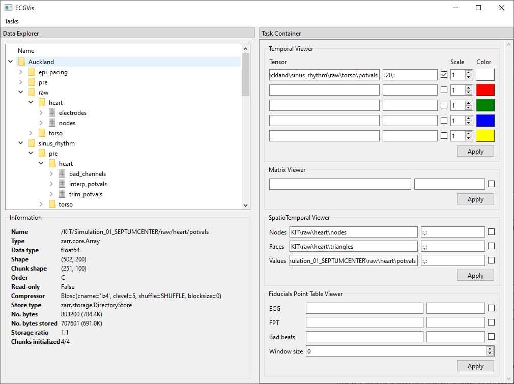
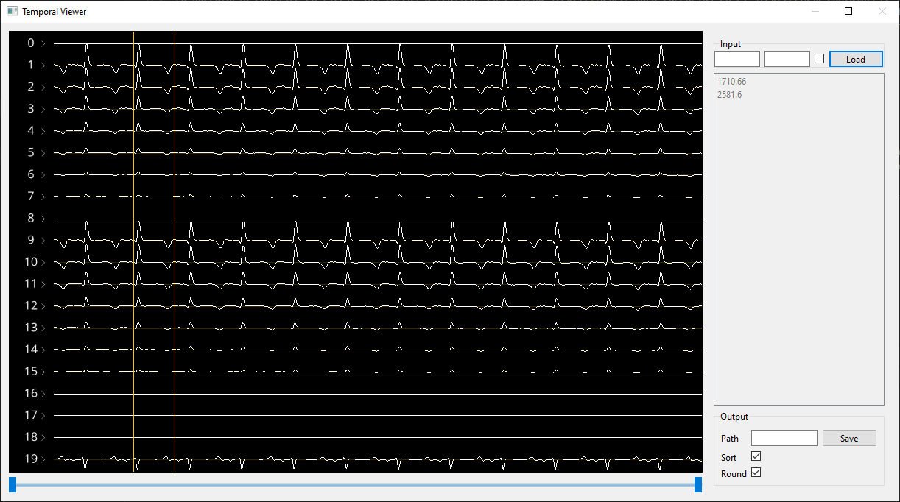
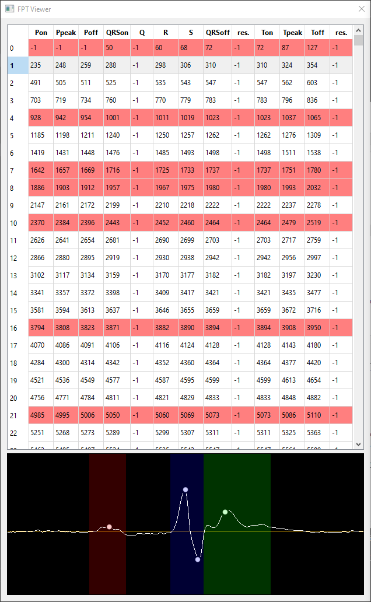
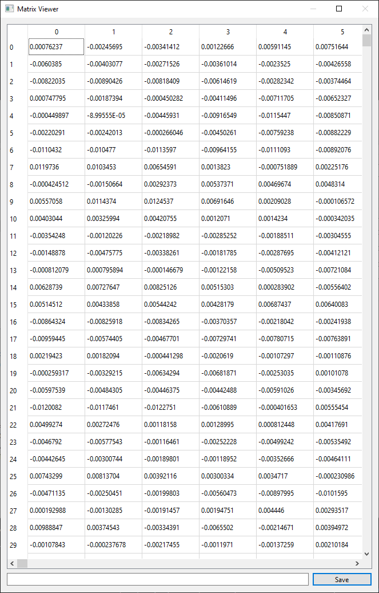
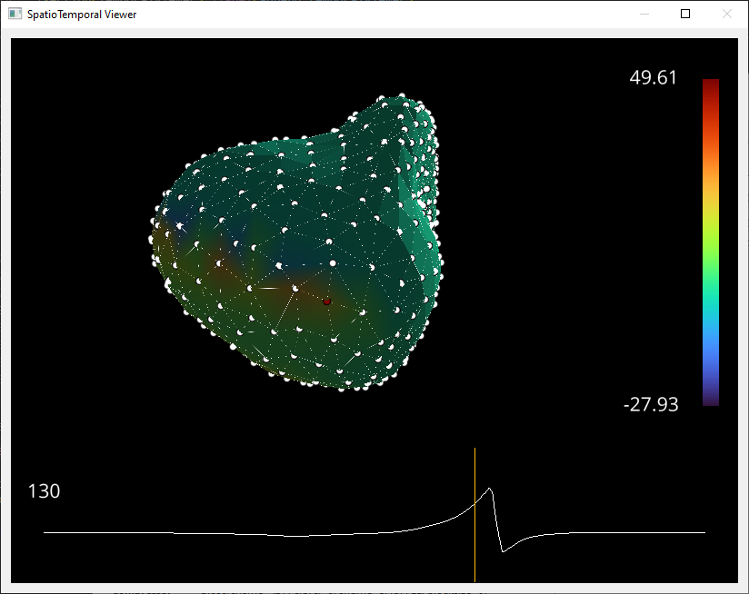

# ECGVis
A desktop application to visualize multichannel ECG & potential maps over cardiac or torso geometries.


# Installation

```
pip install git+https://github.com/sfcaracciolo/ecgvis.git
```

after activation virtual enviroment
```
python ecgvis\run.py <path to zarr model>
```
# How-To (spanish)


ECGVis es un entorno para visualizar señales espacio-temporales relacionado a la electrocardiografía. La GUI ha sido desarrollada en PySide6  y VisPy para graficar datos 3D y series con más de un millón de puntos. 

La ventana principal se ilustra a continuación y cuenta con dos partes: el panel izquierdo donde se muestra el árbol del modelo de datos *Data Explorer*, y el panel derecho donde se agregan las tareas a realizar *Task Container**. 



El modelo de datos debe estar definido en formato Zarr. El explorador de datos mostrará los grupos con ícono de carpeta, y un ícono plateado en los tensores o \textit{arrays}. Seleccionando los elementos del árbol se puede visualizar la información relevante del grupo u *array* en el panel inferior, por ejemplo, el tipo de dato, la dimensión y el espacio que ocupa en memoria, entre otros. 

La operatoria consiste en elegir las tareas a realizar en el menú *Tasks* para cargarlas en el *Task Container*, luego, a través del *Data Explorer* se realiza un *Drag \& Drop* del tensor deseado en el objeto *TensorWidget*. Este objeto permite seleccionar un subconjunto de datos del mismo, a través del esquema de indexado básico y avanzado de NumPy. El *CheckBox* debe seleccionarse para transponer los datos. El botón *Apply* ejecuta la tarea correspondiente y abre una nueva ventana con el resultado. En las siguientes secciones detallamos la funcionalidad de las tareas disponibles.

## TemporalViewer

Esta tarea es un visor multicanal de señales electrocardiográficas. Permite explorar fluídamente más de un millón de puntos y agregar cursores para delinear. Con las teclas `+/-` se agregan/remueven canales en la ventana de visualización, con `Shift + +/- `se modifica la escala en las ordenadas, y con la barra inferior se escala el eje de abcsisas. A través de la rueda del *mouse* se exploran los canales en la ventana de visualización, y con doble *click* se agregan cursores que pueden ser desplazados con *Drag \& Drop*. En el panel derecho se visualizan las posiciones de los cursores. El panel de la derecha permite cargar cursores previos y/o guardar los actuales.



## FPT Viewer

Esta tarea permite explorar la delineación de un electrocardiograma a través de su tabla de puntos fiduciales. En el panel superior se muestra la tabla de puntos fiduciales, donde cada fila corresponde a un latido. Las filas marcadas en rojo indican los latidos cargados en la entrada *bad beats*. En el panel inferior se muestra la fila (latido) seleccionada con sus respectivas marcas. 




## MatrixViewer

El visualizador de matrices permite leer y escribir cualquier *array* seleccionado en el modelo de datos Zarr. Como se ilustra la  entrada del formulario es un *TensorWidget*, por lo tanto, es posible acceder a subconjuntos del tensor original mediante indexado.



## SpatioTemporalViewer

El visualizador espacio-temporal muestra el mapa de potencial sobre una malla y permite al usuario explorar su evolución en el tiempo. En el panel superior se muestra la malla con el potencial y su escala de colores con límites en los valores máximo y mínimo. En el panel inferior, el potencial en función del tiempo del nodo seleccionado en la malla (marcado con punto rojo). La evolución del potencial en la malla se modifica realizando *Drag \& Drop* en el cursor.





El *software* incluye las tareas *ScatterViewer*, *MeshViewer* y *LambdaViewer*, que son similares a la tarea descripta en esta sección, pero adaptado a diferentes entradas. *ScatterViewer* requiere únicamente nodos, *MeshViewer* nodos y triángulos, y *LambdaViewer* admite que el potencial sea parametrizado. Este último caso, se ha utilizado para explorar los mapas de potencial para diferentes valores de $\lambda$ obtenidos en las regularizaciones.
